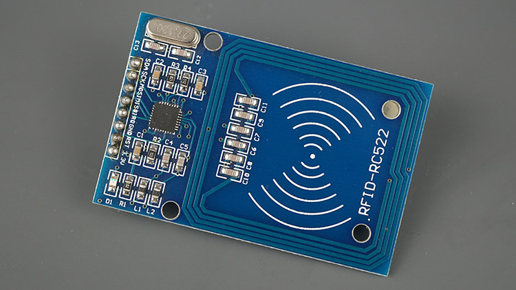
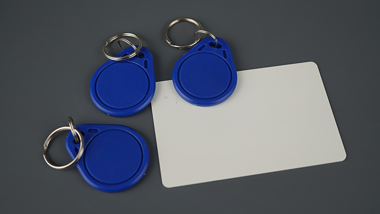
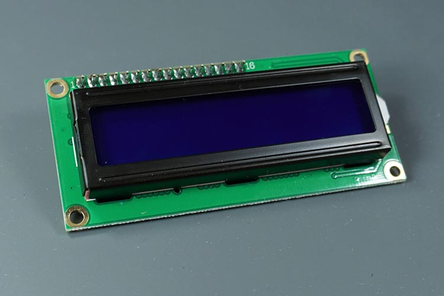
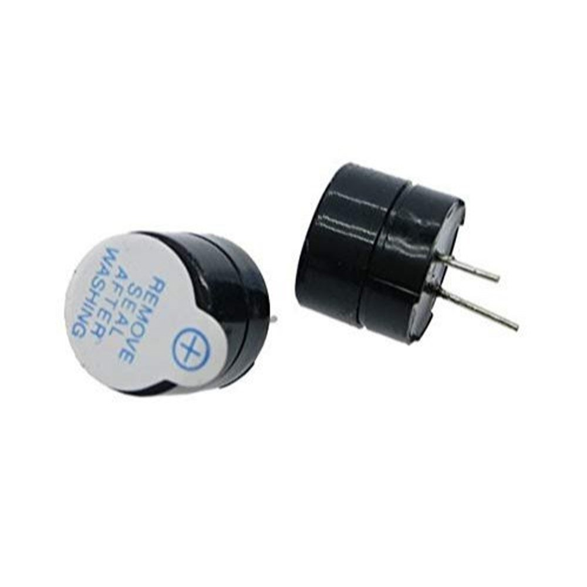

# ESP32 RFID Inventory System

A real-time inventory tracking system built using **ESP32**, **RFID**, **Firebase Realtime Database**, and a **Flutter web dashboard**.

The system records who handled which item and when, enabling live monitoring and historical movement tracking.

---

## 🚀 Features

- RFID based handler authentication  
- Item verification  
- Dual-scan transaction flow  
- Duplicate scan protection  
- Live cloud synchronization  
- Admin dashboard for managing handlers and items  
- Transaction logging with timestamps  
- Audio & visual feedback (LED + buzzer)  
- LCD guided operation

---

## 🧠 How It Works

1. Authorized handler scans their card  
2. Item tag is scanned  
3. System validates both  
4. Stock & movement log are updated in Firebase  
5. Dashboard updates instantly

---

## 🧱 Architecture

ESP32 acts as the field device.  
Firebase acts as the data bridge.  
Flutter provides monitoring and administration.

---

## 📂 Project Structure
firmware/ → ESP32 embedded code
dashboard/ → Flutter web admin panel


---

## 🔌 Hardware Used

- ESP32  
- MFRC522 RFID reader  
- RFID cards & tags  
- I2C 16x2 LCD  
- Buzzer  
- Status LED  

---

## 📌 Pin Connections

| Signal / Component | ESP32 Pin | Description |
|--------------------|-----------|-------------|
| MFRC522 SDA | GPIO 5 | SPI chip select |
| MFRC522 SCK | GPIO 18 | SPI clock |
| MFRC522 MOSI | GPIO 23 | SPI data input |
| MFRC522 MISO | GPIO 19 | SPI master in slave out |
| MFRC522 IRQ | Don’t connect | Interrupt signal |
| MFRC522 RST | GPIO 4 | Reset / power control |
| MFRC522 GND | GND | Ground |
| MFRC522 3.3V | 3.3V | Power supply |

| Buzzer | ESP32 Pin | Description |
|--------|-----------|-------------|
| Signal | GPIO 25 | Audio feedback |
| GND | GND | Ground |

| I2C LCD | ESP32 Pin | Description |
|---------|-----------|-------------|
| SDA | GPIO 21 | I2C data |
| SCL | GPIO 22 | I2C clock |
| VCC | 5V / VIN | Power supply |
| GND | GND | Ground |

---
## ☁️ Realtime Database Structure

Main collections:

```text
root
├── handlers
│   └── 657A7C5
│       ├── cardUid: "657A7C5"
│       ├── name: "manoj h p"
│       ├── role: "shopkeeper"
│       ├── status: "authorized"
│       └── updatedAt: "2026-02-16T17:55:47.589"
│
├── items
│   └── 3A7874
│       ├── uid: "3A7874"
│       ├── name: "laptop"
│       ├── category: "electronics"
│       ├── location: "IN"
│       ├── status: "active"
│       └── createdAt: "2026-02-16T17:56:46.405"
│
└── logs
    └── 16014
        ├── action: "IN"
        ├── handler: "657A7C5"
        ├── item: "3A7874"
        └── time: 17345
```

| Node | Purpose |
|------|---------|
| handlers | authorized people |
| items | inventory master |
| logs | movement history |

---

## 🧩 Components

### ESP32


### MFRC522 Reader


### RFID Cards / Tags


### I2C LCD


### Buzzer


### Demo


---

## 🎯 Key Engineering Concepts

- State machine based flow  
- Hardware abstraction  
- Cloud-driven configuration  
- Real-time sync  
- Embedded reliability patterns

---

## 🧪 Future Improvements

- IN / OUT operation cards  
- Offline caching  
- Role-based access  
- Analytics dashboard  
- Multi-device support  

---

